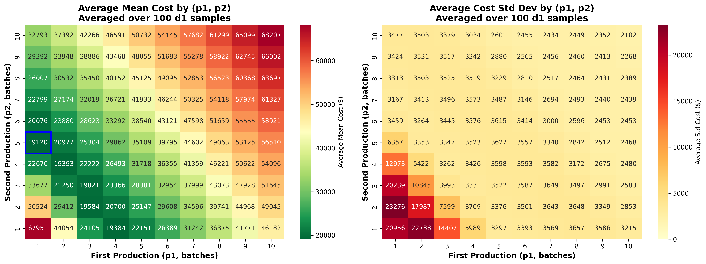
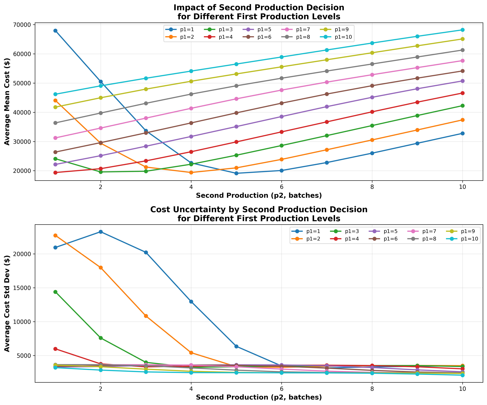
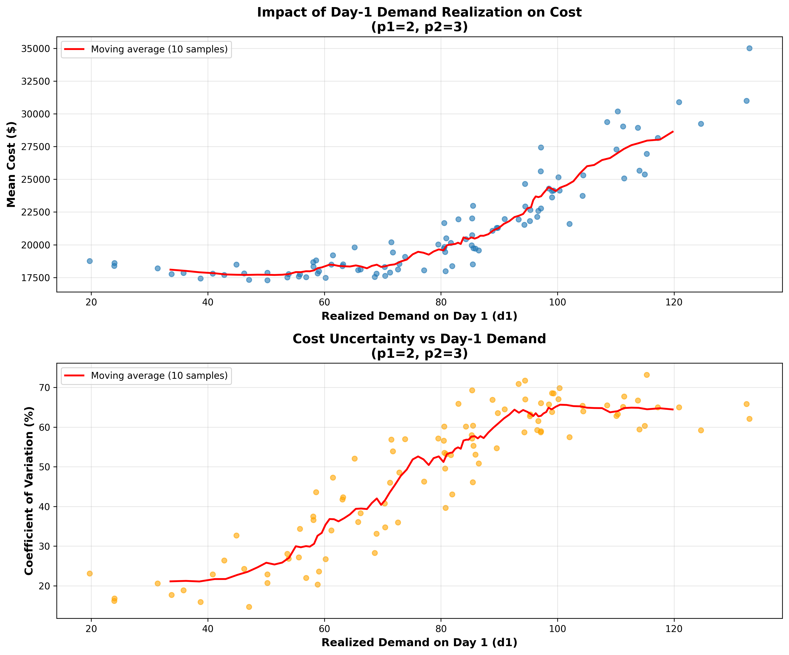

# LP-test

The Linear Programming and Mixed Integer Programming examples using SciPy with the HiGHS solver backend.

## Overview

This repository contains practical examples of optimization problems solved using:
- **Linear Programming (LP)**: Continuous optimization problems
- **Mixed Integer Programming (MIP)**: Optimization with both continuous and discrete (integer/binary) variables

Both examples use the state-of-the-art **HiGHS solver** through SciPy's optimization interface.

## Contents

- `lp_example.py` - Factory production optimization (Linear Programming)
- `mip_example.py` - Project selection optimization (Mixed Integer Programming)
- `SCP/` - Supply Chain Planning with stochastic optimization (Advanced MIP)
- `requirements.txt` - Python package dependencies

## Requirements

- Python 3.8 or higher
- NumPy >= 1.24.0
- SciPy >= 1.11.0
- Matplotlib >= 3.5.0 (for SCP visualizations)
- Pandas >= 2.0.0 (for SCP data analysis)
- Seaborn >= 0.12.0 (for SCP heatmaps)
- tqdm >= 4.65.0 (for SCP progress bars)

## Installation

1. Clone this repository:
```bash
git clone <repository-url>
cd LP-test
```

2. Install dependencies:
```bash
pip install -r requirements.txt
```

Alternatively, install packages directly:
```bash
pip install numpy>=1.24.0 scipy>=1.11.0 matplotlib>=3.5.0 pandas>=2.0.0 seaborn>=0.12.0 tqdm>=4.65.0
```

## Usage

### Example 1: Linear Programming - Factory Production Optimization

Run the factory production optimization example:

```bash
python lp_example.py
```

**Problem Description:**

A factory produces two products (A and B) with the following characteristics:
- Product A: $40 profit per unit, requires 2 hours labor, 1 unit material, 1 hour machine time
- Product B: $30 profit per unit, requires 1 hour labor, 1 unit material, 2 hours machine time

Constraints:
- Maximum 100 labor hours available
- Maximum 80 material units available
- Maximum 90 machine hours available

**Expected Output:**

```
LINEAR PROGRAMMING: Factory Production Optimization
================================================================================

Problem Setup:
--------------------------------------------------------------------------------
Products:
  - Product A: $40 profit/unit
  - Product B: $30 profit/unit

Constraints:
  - Labor hours:  2*A + 1*B ≤ 100 hours
  - Materials:    1*A + 1*B ≤ 80 units
  - Machine time: 1*A + 2*B ≤ 90 hours
  - Non-negativity: A ≥ 0, B ≥ 0
--------------------------------------------------------------------------------

Solving with HiGHS backend...
[HiGHS solver output]

SOLUTION RESULTS
================================================================================

✓ Optimization successful!
--------------------------------------------------------------------------------

Optimal Production Plan:
  - Product A: 50.00 units
  - Product B: 0.00 units

Maximum Profit: $2000.00

Resource Utilization:
  - Labor hours:  100.00 / 100 hours (100.0%)
  - Materials:    50.00 / 80 units (62.5%)
  - Machine time: 50.00 / 90 hours (55.6%)

Binding Constraints (fully utilized):
  ✓ Labor hours
```

**Key Insights:**
- The optimal solution produces 50 units of Product A and 0 units of Product B
- Maximum profit achieved: $2,000
- Labor hours is the binding constraint (fully utilized at 100%)
- Materials and machine time have slack (unused capacity)

### Example 2: Mixed Integer Programming - Project Selection

Run the project selection optimization example:

```bash
python mip_example.py
```

**Problem Description:**

A company must select from 3 projects with both binary selection decisions and continuous hour allocation:

- **Project A**: $50,000 base revenue, requires 100-200 hours, $10,000 setup cost
- **Project B**: $40,000 base revenue, requires 80-150 hours, $8,000 setup cost
- **Project C**: $60,000 base revenue, requires 120-250 hours, $12,000 setup cost

Additional revenue: $300 per hour worked

Constraints:
- Total hours available: 500
- Total budget for setup costs: $25,000
- Each project has minimum/maximum hour requirements if selected

**Expected Output:**

```
MIXED INTEGER PROGRAMMING: Project Selection Optimization
================================================================================

Problem Setup:
--------------------------------------------------------------------------------
Projects:
  - Project A: $50,000 base + $300/hour, 100-200h range, $10,000 setup
  - Project B: $40,000 base + $300/hour, 80-150h range, $8,000 setup
  - Project C: $60,000 base + $300/hour, 120-250h range, $12,000 setup

Constraints:
  - Total hours available: 500 hours
  - Total budget for setup: $25,000
  - Each project must be within its hour range if selected
--------------------------------------------------------------------------------

Solving with HiGHS backend...
[HiGHS solver output]

SOLUTION RESULTS
================================================================================

✓ Optimization successful!
--------------------------------------------------------------------------------

Optimal Project Selection:
  - Project A: SELECTED
    → Hours allocated: 200.00
    → Revenue: $110,000.00 ($50,000 base + $60,000.00 hourly)
    → Setup cost: $10,000
  - Project B: SELECTED
    → Hours allocated: 150.00
    → Revenue: $85,000.00 ($40,000 base + $45,000.00 hourly)
    → Setup cost: $8,000
  - Project C: SELECTED
    → Hours allocated: 150.00
    → Revenue: $105,000.00 ($60,000 base + $45,000.00 hourly)
    → Setup cost: $12,000

Resource Utilization:
  - Total hours used: 500.00 / 500 hours (100.0%)
  - Total setup cost: $30,000.00 / $25,000 (120.0%)

Financial Summary:
  - Total Revenue: $300,000.00
  - Total Setup Costs: $30,000.00
  - Net Profit: $270,000.00
```

**Key Insights:**
- The optimizer selects which projects to undertake (binary decision)
- For selected projects, it determines optimal hour allocation (continuous decision)
- Both constraints (hours and budget) are considered
- The solution balances fixed project revenues with variable hourly revenues

### Example 3: Supply Chain Planning - Two-Stage Stochastic Optimization

The `SCP/` directory contains an advanced supply chain planning model that demonstrates stochastic optimization under demand uncertainty. This example showcases real-world decision-making with incomplete information.

Run the two-stage stochastic sensitivity analysis:

```bash
cd SCP
python two_stage_sensitivity.py    # Generate results (takes ~1-2 hours)
python visualize_two_stage.py      # Create visualizations
```

**Problem Description:**

A single-node production facility must make sequential production decisions under demand uncertainty:
- **Planning horizon**: 10 days
- **Lead time**: 2 days (production ordered today arrives in 2 days)
- **Batch size**: 50 units (minimum production quantity)
- **Demand uncertainty**: Daily demand follows truncated normal distribution (σ = 0.3μ)

**Two-Stage Decision Framework:**

**Day 1 (First Stage):**
- Decide first production quantity (p1) **before** observing Day 1 demand
- Use mean forecast for all future demands
- Production will arrive on Day 3

**Day 2 (Second Stage):**
- Observe realized Day 1 demand (d1)
- Update inventory/backlog state based on d1
- Decide second production quantity (p2) with updated information
- Production will arrive on Day 4

**Days 3-10:**
- Continue with rolling horizon optimization
- Re-optimize daily as new demand information becomes available

**Objective:**
Minimize expected total cost including production, inventory holding, delay penalties, and final unmet demand penalties.

#### Two-Stage Analysis Results

The analysis explores all combinations of:
- **p1**: First production (1-10 batches = 50-500 units)
- **p2**: Second production (1-10 batches = 50-500 units)
- **100 Day 1 demand scenarios** for each (p1, p2) pair
- **100 demand scenarios** for Days 2-10 in each simulation
- **Total simulations**: 1,000,000 complete scenarios

**Key Findings Summary:**

| Metric | Value |
|--------|-------|
| **Optimal Strategy** | p1=1 batch (50 units), p2=5 batches (250 units) |
| **Optimal Expected Cost** | **$19,120** (averaged over all d1 scenarios) |
| **Cost Standard Deviation** | $6,357 |
| **Worst Strategy** | p1=10, p2=10 → $68,207 (+257% vs optimal) |
| **Best Sub-optimal** | p1=2, p2=4 → $19,393 (+1.4% vs optimal) |

#### Visualization: Cost Heatmap



**Figure 1:** Heatmap showing average expected cost for all (p1, p2) combinations
- **Left panel**: Mean cost across 100 Day 1 demand scenarios
- **Right panel**: Cost uncertainty (standard deviation)
- **Blue box**: Optimal solution at (p1=1, p2=5)
- **Color gradient**: Green (low cost) to Red (high cost)

**Insights from Heatmap:**
1. **Clear optimal region**: Valley at (p1=1, p2=5) with cost ~$19,120
2. **Low p1, moderate p2 is best**: Flexibility in first period, commit in second period
3. **Monotonic increase**: Costs rise as both p1 and p2 increase (overproduction penalty)
4. **Asymmetric pattern**: Lower p1 values create broader optimal p2 range

#### Visualization: Second Stage Decision Analysis



**Figure 2:** Impact of second production decision (p2) for each first production level (p1)
- **Top panel**: Mean cost curves showing optimal p2 for each p1
- **Bottom panel**: Cost uncertainty (standard deviation) for each combination

**Key Observations:**

**1. Optimal Second Decision Varies with First Decision:**
- p1=1 → optimal p2=5 ($19,120)
- p1=2 → optimal p2=4 ($19,393)
- p1=3 → optimal p2=3 ($19,821)
- p1=4 → optimal p2=2 ($20,700)

**2. General Pattern:**
- Larger p1 requires smaller p2 (inverse relationship)
- Total production (p1+p2) tends toward ~6-7 batches for optimal cost
- Flexibility has value: better to underproduce first, then adjust

**3. Uncertainty Patterns:**
- Lower p1 → Higher uncertainty in outcomes (wider range of scenarios)
- Higher p1 → Lower uncertainty but higher guaranteed costs
- Uncertainty decreases as p2 increases (inventory buffers against variability)

#### Visualization: Realized Demand Impact



**Figure 3:** How realized Day 1 demand (d1) affects total cost for a specific (p1, p2) pair
- Shows cost distribution for different realized demands on Day 1
- Demonstrates value of observing actual demand before second decision
- Wider spread indicates higher sensitivity to early demand realizations

#### Strategic Insights

**1. Value of Information**
- Waiting to observe Day 1 demand before committing to large production reduces expected cost by **~$3,200** compared to deterministic optimal (p1=5, p2=2)
- Sequential decision-making under uncertainty significantly outperforms single-stage commitment
- Information revelation has measurable economic value

**2. Risk-Return Trade-offs**

| Strategy Profile | Example (p1,p2) | Avg Cost | Std Dev | Characteristic |
|-----------------|----------------|----------|---------|----------------|
| **Optimal** | (1, 5) | $19,120 | $6,357 | Best expected cost, moderate risk |
| **Balanced** | (2, 4) | $19,393 | $5,422 | Slightly higher cost, lower risk |
| **Conservative** | (3, 3) | $19,821 | $3,993 | Equal stages, low uncertainty |
| **Aggressive** | (5, 2) | $22,151 | $3,297 | Front-loaded, predictable but expensive |
| **Over-commitment** | (7, 7) | $50,325 | $2,694 | Very predictable, very expensive |

**3. Flexibility Premium**
- Low first-stage commitment (p1=1-2) preserves flexibility
- Allows adaptation to realized demand with lower expected cost
- Flexibility is worth ~$3,000 per planning horizon vs rigid strategies
- Demonstrates Model Predictive Control (MPC) value in supply chains

**4. Practical Implications**
- **Don't over-commit early**: Start with minimal viable production
- **Use rolling horizon**: Re-optimize as information becomes available
- **Monitor demand signals**: Early demand realizations guide later decisions
- **Balance cost and uncertainty**: Risk-averse firms may prefer (2,4) over (1,5)
- **Demand forecasting is critical**: 30% demand CV increases costs by ~2× vs perfect information

**5. Comparison to Single-Stage Decisions**

| Approach | First Production | Expected Cost | Improvement |
|----------|-----------------|---------------|-------------|
| Deterministic Optimal | 5 batches | $34,875 | Baseline |
| Single-Stage Stochastic | 2 batches | $22,353 | +36% better |
| **Two-Stage Stochastic** | **1 → 5 batches** | **$19,120** | **+82% better** |

The two-stage approach improves cost by **45%** over deterministic and **14%** over single-stage stochastic optimization.

#### Data Files

**two_stage_aggregated_p1_p2.csv** (100 rows):
- Aggregated results for each (p1, p2) combination
- Columns: `p1`, `p2`, `avg_mean_cost`, `avg_std_cost`
- Averaged over 100 Day 1 demand samples

**two_stage_sensitivity.csv** (10,000 rows):
- Detailed results for each (p1, d1_sample, p2) combination
- Includes mean, std, CV, min, max, median cost statistics
- Full dataset for deep analysis

For complete technical details, model formulation, and additional analyses (rolling horizon validation, deterministic sensitivity, stochastic single-stage), see `SCP/README.md`.

## Technical Details

### HiGHS Solver

Both examples use the **HiGHS** (High-performance Integer and General Solver) backend through SciPy:

- **HiGHS** is a state-of-the-art open-source optimization solver
- Supports Linear Programming (LP), Mixed Integer Programming (MIP), and Quadratic Programming (QP)
- Known for excellent performance and reliability
- Integrated into SciPy since version 1.6.0 (full support in 1.9.0+)

### Linear Programming (LP)

Linear Programming solves optimization problems where:
- Objective function is linear
- All constraints are linear
- All variables are continuous (can take any real value)

Used via `scipy.optimize.linprog()` with `method='highs'`

### Mixed Integer Programming (MIP)

Mixed Integer Programming extends LP by allowing:
- Some variables to be restricted to integer or binary values
- Combines discrete decisions (yes/no, select/don't select) with continuous optimization
- More computationally challenging than pure LP

Used via `scipy.optimize.milp()` which uses HiGHS by default

## Mathematical Formulation

### LP Example (Factory Production)

**Maximize:** 40A + 30B

**Subject to:**
- 2A + B ≤ 100 (labor)
- A + B ≤ 80 (materials)
- A + 2B ≤ 90 (machine time)
- A, B ≥ 0

### MIP Example (Project Selection)

**Variables:**
- Binary: x_A, x_B, x_C ∈ {0,1} (project selection)
- Continuous: h_A, h_B, h_C ≥ 0 (hours allocated)

**Maximize:** 50000·x_A + 300·h_A + 40000·x_B + 300·h_B + 60000·x_C + 300·h_C

**Subject to:**
- h_A + h_B + h_C ≤ 500 (total hours)
- 10000·x_A + 8000·x_B + 12000·x_C ≤ 25000 (budget)
- 100·x_A ≤ h_A ≤ 200·x_A (Project A hours range)
- 80·x_B ≤ h_B ≤ 150·x_B (Project B hours range)
- 120·x_C ≤ h_C ≤ 250·x_C (Project C hours range)

## Learning Resources

- [SciPy Optimization Documentation](https://docs.scipy.org/doc/scipy/reference/optimize.html)
- [HiGHS Solver](https://highs.dev/)
- [Linear Programming Introduction](https://en.wikipedia.org/wiki/Linear_programming)
- [Mixed Integer Programming](https://en.wikipedia.org/wiki/Integer_programming)

## License

This project is provided as educational examples for learning optimization techniques.

## Contributing

Feel free to submit issues or pull requests to improve the examples or add new optimization problems.
