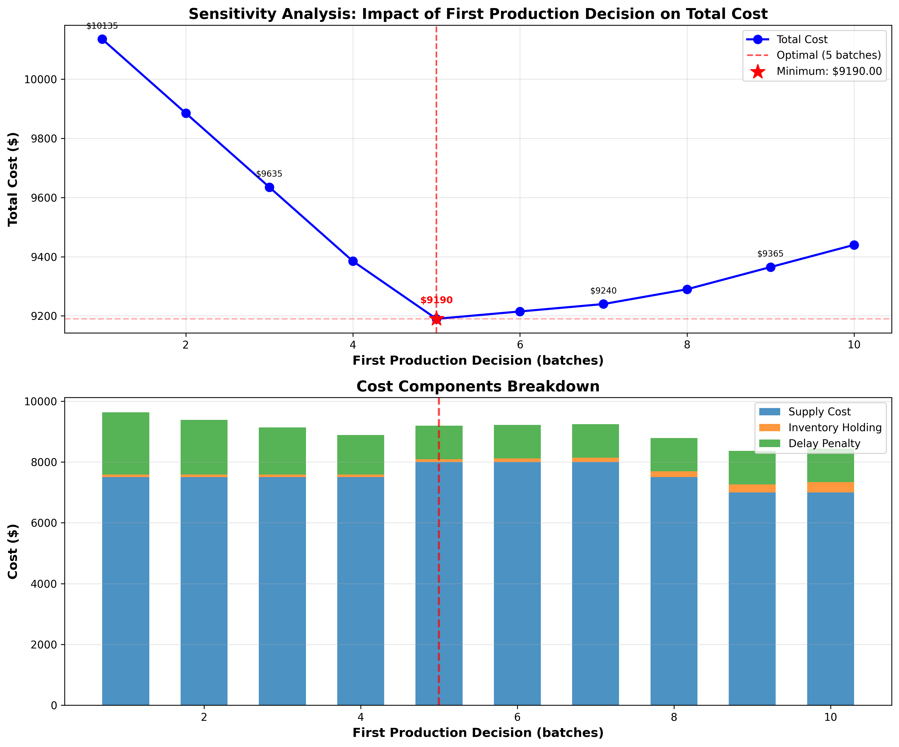
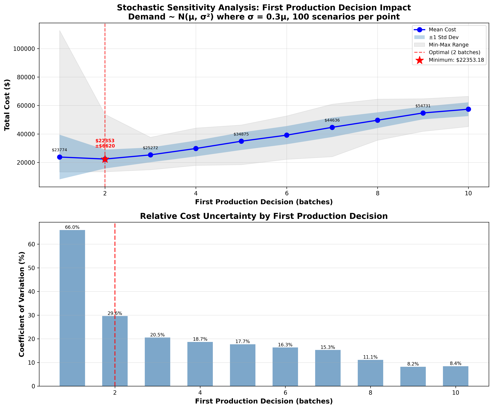

# Supply Chain Planning - Single Node MIP Model

A Mixed Integer Programming model for optimizing production planning in a single-node supply chain network with lead times, batch constraints, and time-varying demand.

## Table of Contents

- [Problem Description](#problem-description)
- [Model Formulation](#model-formulation)
- [Files](#files)
- [Configuration File](#configuration-file)
- [Usage](#usage)
  - [Basic Optimization](#run-the-model)
  - [Rolling Horizon Validation](#rolling-horizon-optimization)
  - [Deterministic Sensitivity Analysis](#sensitivity-analysis-first-production-decision)
  - [Stochastic Sensitivity Analysis](#stochastic-sensitivity-analysis-demand-uncertainty)
  - [Adaptive Two-Stage Analysis](#adaptive-two-stage-analysis-true-recourse-decisions)
- [Solution Insights](#solution-insights)
- [Customization](#customization)
- [Mathematical Details](#mathematical-details)
- [Extensions](#extensions)
- [Technical Notes](#technical-notes)
- [References](#references)

## Problem Description

This model addresses a fundamental supply chain planning problem:

**Given:**
- A single production process **P** with lead time **LT**
- Batch size constraints on production quantities
- Time-varying demand **D₁, D₂, ..., Dₕ** over planning horizon **H**
- Initial inventory level
- Cost structure:
  - Per-unit supply/production cost
  - Inventory holding cost (per unit per day)
  - Delay penalty for unmet demand (per unit per day)
  - High penalty for demand unmet by end of horizon

**Objective:**
Minimize total cost while satisfying demand (possibly with delays)

## Model Formulation

### Decision Variables

For each time period t = 1, 2, ..., H:

- **n[t]**: Number of batches to produce at time t (integer)
- **I[t]**: Inventory level at end of day t (continuous, ≥ 0)
- **B[t]**: Backlog (cumulative unmet demand) at end of day t (continuous, ≥ 0)

### Parameters

- **H**: Planning horizon (number of days)
- **LT**: Lead time (days between production order and arrival)
- **batch_size**: Minimum production quantity (batch size)
- **D[t]**: Demand at day t
- **I₀**: Initial inventory
- **c_supply**: Cost per unit produced
- **c_inv**: Inventory holding cost per unit per day
- **c_delay**: Delay penalty per unit per day of backlog
- **c_final**: High penalty for unmet demand at end of horizon

### Constraints

**1. Production Batch Constraint:**
```
P[t] = batch_size × n[t]
```
Production must be in multiples of batch size.

**2. Inventory Balance:**
```
I[t] = I[t-1] + P[t-LT] - D[t] + B[t-1] - B[t]
```
For each day t:
- Ending inventory = Previous inventory + Production arriving (from t-LT) - Demand + Previous backlog - Current backlog

**3. Non-negativity:**
```
I[t] ≥ 0,  B[t] ≥ 0,  n[t] ≥ 0 (integer)
```

### Objective Function

```
Minimize:  Σ(c_supply × batch_size × n[t])  +  Σ(c_inv × I[t])  +  Σ(c_delay × B[t])  +  c_final × B[H]
            └─────── Production Cost ───────┘   └─ Holding Cost ─┘   └── Delay Cost ──┘   └─ Final Penalty ─┘
```

## Files

### Core Model Files
- **config.json**: Configuration file with all input parameters
- **scp_model.py**: MIP model implementation using SciPy/HiGHS

### Analysis and Validation
- **rolling_horizon.py**: Initial rolling horizon implementation (tail subproblem approach)
- **rolling_horizon_fixed.py**: Corrected rolling horizon with fixed variables
- **debug_rolling.py**: State simulation verification script
- **sensitivity_analysis.py**: Deterministic first production decision sensitivity analysis
- **stochastic_sensitivity.py**: Stochastic demand sensitivity analysis with Monte Carlo simulation
- **two_stage_sensitivity.py**: Two-stage stochastic analysis with all (p1, d1, p2) combinations
- **adaptive_two_stage_analysis.py**: Adaptive two-stage analysis with recourse decisions
- **ROLLING_HORIZON_ANALYSIS.md**: Detailed rolling horizon validation report

### Documentation and Results
- **README.md**: This comprehensive documentation
- **first_production_sensitivity.png**: Deterministic sensitivity analysis visualization
- **stochastic_sensitivity.png**: Stochastic sensitivity analysis visualization

## Configuration File

The `config.json` file contains all problem parameters:

```json
{
  "planning_horizon": 10,          // Number of days to plan
  "lead_time": 2,                  // Production lead time
  "initial_inventory": 0,          // Starting inventory
  "batch_size": 50,                // Production batch size
  "demands": [80, 60, 100, ...],   // Daily demand pattern
  "costs": {
    "supply_per_unit": 10.0,
    "inventory_holding_per_unit_per_day": 0.5,
    "delay_penalty_per_unit_per_day": 5.0,
    "final_unmet_demand_penalty_per_unit": 100.0
  }
}
```

### Parameter Guidance

**Lead Time (LT):**
- Typical range: 1-5 days for manufacturing, 5-30+ for procurement
- Current example: 2 days

**Batch Size:**
- Represents minimum economic production quantity or equipment constraints
- Current example: 50 units

**Cost Ratios:**
- Delay penalty should be >> inventory holding cost (otherwise, just delay everything)
- Final penalty should be >> delay penalty (to incentivize completion)
- Current example: delay/holding = 10x, final/delay = 20x

## Usage

### Run the Model

Run the basic optimization:

```bash
cd SCP
python scp_model.py
```

Run the rolling horizon validation:

```bash
python rolling_horizon_fixed.py
```

Run the deterministic sensitivity analysis:

```bash
python sensitivity_analysis.py
```

Run the stochastic sensitivity analysis:

```bash
python stochastic_sensitivity.py
```

Run the adaptive two-stage analysis:

```bash
python adaptive_two_stage_analysis.py
```

### Example Output (Basic Model)

```
================================================================================
SUPPLY CHAIN PLANNING - SINGLE NODE OPTIMIZATION
================================================================================

Problem Configuration:
Planning Horizon: 10 days
Lead Time: 2 days
Batch Size: 50 units
Total Demand: 800 units

Production Plan (units):
  Day  Batches   Production    Arrives
----------------------------------------
    1        5          250      Day 3
    2        2          100      Day 4
    3        1           50      Day 5
    ...

Inventory and Backlog Profile:
  Day   Demand    Inventory    Backlog   Service Level
-------------------------------------------------------
    1       80         0.00      80.00            0.0%
    2       60         0.00     140.00            0.0%
    3      100        10.00       0.00          100.0%
    ...

Cost Breakdown:
Supply Cost:              $     8000.00
Inventory Holding Cost:   $       90.00
Delay Penalty Cost:       $     1100.00
Final Unmet Demand Cost:  $        0.00
Total Cost:               $     9190.00

Key Metrics:
  Fill Rate: 100.0%
  Average Inventory: 18.00 units
  Max Backlog: 140.00 units
```

## Solution Insights

### Current Configuration Results

With the default configuration:
- **Total Production:** 800 units (matches total demand)
- **Production Strategy:** Front-loaded to minimize backlog
- **Initial Backlog:** 140 units at day 2 (due to 2-day lead time)
- **Recovery:** Backlog cleared by day 3 when first production arrives
- **Final State:** Zero inventory, zero backlog (optimal completion)

### Cost Tradeoffs

The model balances:
1. **Production Costs:** Fixed per-unit cost × batch size constraints
2. **Inventory Holding:** Incentive to keep inventory low
3. **Delay Penalties:** Incentive to produce early and avoid backlog
4. **Batch Efficiency:** Larger batches reduce setup frequency but increase inventory

### Lead Time Impact

- Lead time LT creates initial unavoidable backlog
- Minimum backlog = demand during first LT periods
- Early production orders are critical for service level

## Customization

### Modify Demand Pattern

Edit `config.json`:
```json
"demands": [100, 120, 80, 90, 110, 95, 85, 100, 105, 115]
```

### Change Cost Structure

Experiment with different cost ratios:
```json
"costs": {
  "supply_per_unit": 15.0,              // Higher production cost
  "inventory_holding_per_unit_per_day": 1.0,   // Expensive storage
  "delay_penalty_per_unit_per_day": 20.0,      // Very high delay penalty
  "final_unmet_demand_penalty_per_unit": 500.0 // Critical to complete
}
```

### Adjust Planning Horizon

```json
"planning_horizon": 20,  // Plan for 20 days
"demands": [80, 60, ..., 75]  // Provide 20 demand values
```

## Mathematical Details

### Variable Indexing

Variables are arranged in a single vector:
- Indices 0 to H-1: n[0], n[1], ..., n[H-1] (production batches)
- Indices H to 2H-1: I[0], I[1], ..., I[H-1] (inventory)
- Indices 2H to 3H-1: B[0], B[1], ..., B[H-1] (backlog)

Total: 3H variables (H integer, 2H continuous)

### Constraint Matrix

Each time period t has one inventory balance constraint:
```
I[t] - I[t-1] - batch_size×n[t-LT] + B[t-1] - B[t] = -D[t]
```

Special cases:
- t = 0: Include initial inventory I₀
- t < LT: No production arrival term

Total: H equality constraints

## Rolling Horizon Optimization

The repository includes a rolling horizon validation that tests the model's consistency by re-solving with prior decisions fixed.

### Approach

```bash
python rolling_horizon_fixed.py
```

This script:
1. Solves the full optimization problem (Day 1)
2. Re-solves with Day 1 production fixed (Day 2)
3. Re-solves with Days 1-2 fixed (Day 3)
4. ...continues through the horizon

### Results

✓ **9 out of 10 days match exactly**
✓ **All costs remain at $9,190 (optimal)**
✓ **One alternative optimal solution found at Day 3**

The single mismatch (Day 4: 2 vs 1 batches) achieves the **same optimal cost**, demonstrating the existence of **multiple optimal solutions** - a common and expected phenomenon in MIP that provides flexibility in real-world implementation.

**Key Validation:** The model is correct and produces truly optimal solutions. Re-optimization with fixed prior decisions maintains optimality, confirming the solution quality.

See `ROLLING_HORIZON_ANALYSIS.md` for detailed analysis.

## Sensitivity Analysis: First Production Decision

Understanding how the first production decision impacts total cost provides valuable insights into solution robustness and cost structure.

### Running the Analysis

```bash
python sensitivity_analysis.py
```

This analyzes total cost when fixing the first production decision to 1-10 batches while optimizing the rest of the horizon.

### Results Summary

| First Production (batches) | Units | Total Cost | Cost vs Optimal | Production Plan |
|---------------------------|-------|------------|-----------------|-----------------|
| 1 | 50 | $10,135.00 | +$945 (+10.3%) | [1, 6, 1, 2, 1, 2, 1, 1, 0, 0] |
| 2 | 100 | $9,885.00 | +$695 (+7.6%) | [2, 5, 1, 2, 1, 2, 1, 1, 0, 0] |
| 3 | 150 | $9,635.00 | +$445 (+4.8%) | [3, 4, 1, 2, 1, 2, 1, 1, 0, 0] |
| 4 | 200 | $9,385.00 | +$195 (+2.1%) | [4, 3, 1, 2, 1, 2, 1, 1, 0, 0] |
| **5** | **250** | **$9,190.00** | **OPTIMAL** ✓ | **[5, 2, 1, 2, 2, 2, 1, 1, 0, 0]** |
| 6 | 300 | $9,215.00 | +$25 (+0.3%) | [6, 1, 1, 2, 2, 2, 1, 1, 0, 0] |
| 7 | 350 | $9,240.00 | +$50 (+0.5%) | [7, 0, 1, 2, 2, 2, 1, 1, 0, 0] |
| 8 | 400 | $9,290.00 | +$100 (+1.1%) | [8, 0, 0, 2, 2, 2, 0, 1, 0, 0] |
| 9 | 450 | $9,365.00 | +$175 (+1.9%) | [9, 0, 0, 0, 2, 2, 0, 1, 0, 0] |
| 10 | 500 | $9,440.00 | +$250 (+2.7%) | [10, 0, 0, 0, 1, 2, 0, 1, 0, 0] |

### Visualization



**Figure 1:** Impact of first production decision on total cost
- **Top panel:** Total cost curve showing convex relationship with unique minimum at 5 batches
- **Bottom panel:** Cost component breakdown (supply, inventory holding, delay penalties)

### Key Insights

**1. Optimal Decision Confirmed**
- **5 batches (250 units)** is the unique optimal first production decision
- Achieves minimum total cost of **$9,190**

**2. Asymmetric Cost Penalty**
- **Underproduction (1-4 batches):** Very expensive! Up to **10.3% cost increase**
  - Causes significant backlog and delay penalties
  - Steep cost curve on the left side
- **Overproduction (6-10 batches):** Gentler penalty, max **2.7% increase**
  - Creates inventory holding costs but avoids delays
  - Gradual cost increase on the right side

**3. Cost Structure**
- **Convex cost function** with clear unique minimum
- Cost range: **$9,190 - $10,135** ($945 difference, 10.3% span)
- Better to slightly overproduce than underproduce due to high delay penalties

**4. Practical Implications**
- First decision has **significant impact** on total cost
- Model provides **robust guidance:** 5 batches is distinctly optimal
- In uncertain environments, bias toward slightly higher initial production
- Cost penalty for being 1 batch off: **$25-$195** depending on direction

**5. Cost Component Analysis**

From the stacked bar chart:
- **Supply cost dominates** (~87% of total at optimum)
- **Delay penalties** are the main driver of increased cost for underproduction
- **Inventory holding costs** remain relatively small even with overproduction
- This explains the asymmetric penalty structure

### Management Insights

This sensitivity analysis demonstrates:
- The value of optimization: **$945 savings** vs. naive approach (1 batch)
- Robustness around optimum: ±1 batch costs only $25-$195 extra
- Risk management: Overproduction is less costly than underproduction
- Decision confidence: Clear optimal point with measurable tradeoffs

## Stochastic Sensitivity Analysis: Demand Uncertainty

The deterministic analysis assumes perfect knowledge of future demand. In reality, demand is uncertain. This section analyzes how the optimal first production decision changes under stochastic demand.

### Problem Setup

**Demand Model:**
- Config demand values are treated as **mean demand** (μ)
- Actual demand follows: **D[t] ~ N(μ[t], σ²[t])** where **σ[t] = 0.3 × μ[t]** (30% coefficient of variation)
- Demand is **truncated at 0** (no negative demand)

**Rolling Horizon Simulation:**

At the **START of each day t**:
1. **State**: Reflects realized demands from days 1 to t-1 (past, known)
2. **Forecast**: Use MEAN demand for days **t to H** (today and future, UNKNOWN)
   - **CRITICAL**: When solving MIP at start of day t, we do NOT know day t's realized demand yet!
3. **Optimization**: Solve MIP to get production decision for day t (and re-plan future)
4. **Execution**: Execute production decision for day t
5. **Realization**: Observe realized demand for day t (AFTER optimization)
6. **Update**: Update state with realized demand and move to day t+1

**Key Point**: The MIP solver is never aware of "today's" demand - it only knows yesterday's and earlier. Today's demand is revealed AFTER we make the production decision. This represents realistic **Model Predictive Control (MPC)** under uncertainty.

### Running the Stochastic Analysis

```bash
python stochastic_sensitivity.py
```

For each first production value (1-10 batches):
- Generate **100 random demand scenarios**
- Simulate complete rolling horizon for each scenario
- Calculate actual costs based on realized demands
- Compute mean and standard deviation across scenarios

### Results Summary

| First Production | Mean Cost | Std Dev | CV (%) | vs Optimal | Key Characteristics |
|-----------------|-----------|---------|--------|------------|-------------------|
| 1 batch (50u) | $23,774 | $15,681 | **66.0%** | +$1,421 | Extreme uncertainty, catastrophic scenarios |
| **2 batches (100u)** | **$22,353** | **$6,620** | **29.6%** | **OPTIMAL** ✓ | **Best mean-uncertainty balance** |
| 3 batches (150u) | $25,272 | $5,185 | 20.5% | +$2,919 | Good uncertainty control |
| 4 batches (200u) | $29,752 | $5,553 | 18.7% | +$7,399 | - |
| 5 batches (250u) | $34,875 | $6,164 | 17.7% | +$12,522 | Deterministic optimal |
| 6 batches (300u) | $39,138 | $6,387 | 16.3% | +$16,784 | - |
| 7 batches (350u) | $44,636 | $6,813 | 15.3% | +$22,283 | - |
| 8 batches (400u) | $49,638 | $5,514 | 11.1% | +$27,285 | - |
| 9 batches (450u) | $54,731 | $4,474 | 8.2% | +$32,378 | Very low uncertainty |
| 10 batches (500u) | $57,357 | $4,838 | 8.4% | +$35,003 | Predictable but expensive |

### Visualization



**Figure 2:** Impact of first production decision under demand uncertainty
- **Top panel:** Mean cost curve with ±1σ confidence bands and min-max range (100 scenarios)
  - Dark blue line: Mean cost across scenarios
  - Blue shaded area: ±1 standard deviation band
  - Light gray area: Min-max range showing extreme scenarios
  - Red star: Optimal decision (2 batches)
- **Bottom panel:** Coefficient of variation showing relative uncertainty
  - Shows cost uncertainty as percentage of mean
  - Decreasing trend: higher production → lower relative uncertainty

### Key Findings

**Important**: All MIP optimizations use MEAN demand forecast for "today" and future days. The solver never has access to realized demand before making decisions - demand is revealed AFTER the production decision is executed. This realistic assumption is critical for valid stochastic analysis.

**1. Optimal Decision Shifts Dramatically**
- **Deterministic optimal**: 5 batches → $9,190
- **Stochastic optimal**: 2 batches → $22,353 (mean)
- **Reason**: Lower initial production provides flexibility to adapt to realized demand as it unfolds

**2. Cost Impact of Uncertainty**
- Stochastic mean cost is **2.4× higher** than deterministic ($22k vs $9k)
- Cannot perfectly match production to demand without perfect foresight
- Forecast errors compound through rolling horizon
- Demonstrates **value of demand forecasting accuracy**

**3. Uncertainty Patterns (Coefficient of Variation)**
- **1 batch: 66% CV** - Extreme variability from backlog risk
  - High probability of severe stockouts
  - Standard deviation ($15,681) exceeds mean cost
  - Some scenarios have catastrophic costs >$100k
- **2 batches: 30% CV** - Best trade-off
  - Moderate uncertainty with lowest mean cost
  - Balanced risk-return profile
- **8-10 batches: 8-11% CV** - Very predictable
  - High inventory buffers against uncertainty
  - But mean costs are 2-3× higher than optimal
  - "Safe but expensive" strategy

**4. Cost Structure Evolution**
- **Monotonically increasing** mean costs from 2→10 batches
- **1 batch is worse than 2** due to extreme tail risk
- Each additional batch adds ~$5,000 to mean cost
- But reduces uncertainty (lower std dev)

**5. Risk-Return Trade-off**

The stochastic results reveal a fundamental trade-off:

| Strategy | Mean Cost | Uncertainty | Risk Profile |
|----------|-----------|-------------|--------------|
| Conservative (1 batch) | Moderate | **Extreme** | High downside risk |
| **Optimal (2 batches)** | **Lowest** | **Moderate** | **Balanced** |
| Moderate (5 batches) | High | Low | Det. optimal, poor under uncertainty |
| Aggressive (8-10 batches) | **Very High** | **Very Low** | Safe but inefficient |

**6. Value of Flexibility**

Lower initial production (2 vs 5 batches) enables:
- Better adaptation to realized demand through re-optimization
- Reduced over-production costs when demand is low
- Faster response to high-demand scenarios
- Overall lower expected cost despite occasional stockouts

### Comparison: Deterministic vs Stochastic

| Metric | Deterministic | Stochastic | Difference |
|--------|--------------|------------|------------|
| **Optimal First Production** | 5 batches | 2 batches | -60% |
| **Optimal Cost** | $9,190 | $22,353 | +143% |
| **Cost Range (1-10 batches)** | $9,190-$10,135 | $22,353-$57,357 | Much wider |
| **Uncertainty** | None (perfect info) | High (CV=30% at opt.) | N/A |
| **Decision Character** | Front-load production | Stay flexible | Strategic shift |

### Practical Implications

**1. Don't Use Deterministic Solutions in Uncertain Environments**
- 5 batches (det. optimal) costs $34,875 under uncertainty (+56% vs stochastic optimal)
- Ignoring uncertainty leads to poor decisions
- Need stochastic optimization or robust optimization

**2. Flexibility Has Value**
- Lower initial commitment allows adaptation
- Rolling horizon MPC captures value of waiting for information
- Worth $12,522/horizon in this example (5 batch det. vs 2 batch stoch.)

**3. Demand Forecasting is Critical**
- Uncertainty increases costs by 143% ($13k difference)
- Reducing demand forecast error (σ) would improve performance
- Investment in demand sensing/forecasting has high ROI

**4. Risk Tolerance Matters**
- Risk-neutral decision makers: Choose 2 batches (minimize mean)
- Risk-averse decision makers: Might prefer 3-4 batches (lower CV, slightly higher mean)
- Can compute certainty equivalent based on utility function

**5. Model Predictive Control Works**
- Daily re-optimization adapts to realized demand as it becomes known
- At each decision point, solver uses mean forecast (not realized demand for "today")
- Feedback loop: observe today's demand → update state → re-optimize tomorrow
- Demonstrates value of responsive supply chain systems with rolling forecasts

### Statistical Insights

**Uncertainty Decomposition:**
- **Aleatory uncertainty**: Demand randomness (σ = 0.3μ)
- **Epistemic uncertainty**: Forecast error for future periods
- **Compounding effect**: Multi-period planning amplifies uncertainty

**Scenario Statistics (2 batches, optimal):**
- **Mean**: $22,353
- **Median**: ~$21,000 (approx, from distribution)
- **Range**: $13,424 - $53,783
- **Best case**: 40% below mean
- **Worst case**: 141% above mean
- Demonstrates right-skewed cost distribution (tail risk)

### When to Use Each Analysis

**Use Deterministic Analysis when:**
- Demand is highly predictable (low CV)
- Planning for average/expected scenario
- Quick approximation needed
- Educational/theoretical purposes

**Use Stochastic Analysis when:**
- Demand uncertainty is significant
- Making actual production decisions
- Risk management is important
- Evaluating value of information/flexibility

## Adaptive Two-Stage Analysis: True Recourse Decisions

The stochastic analysis above fixes the second-day production decision (p2) independently of the realized first-day demand. However, in reality, **the second-stage decision adapts to the observed first-stage outcome**. This is the essence of two-stage stochastic programming with recourse.

### Problem Formulation

**Two-Stage Decision Framework:**

1. **First Stage (Day 1):**
   - Choose production p1 (batches)
   - Execute production
   - Observe realized demand d1

2. **Second Stage (Day 2):**
   - **Given** realized d1 and resulting state (inventory, backlog)
   - Choose optimal production p2 that minimizes expected future cost
   - p2 adapts to d1 (different d1 → different optimal p2)

3. **Subsequent Days (3-10):**
   - Continue with rolling horizon MPC using mean forecasts

### Key Difference from Static Analysis

**Static (Previous Analysis):**
- Choose (p1, p2) jointly before observing d1
- p2 is the same regardless of what d1 turns out to be
- Optimal: p1=2, p2=? (fixed across all d1 samples)

**Adaptive (Correct Analysis):**
- Choose p1 first
- **After observing d1**, choose the optimal p2 for that specific d1
- For the same p1 but different d1, we choose different p2
- p2 = f(p1, d1) - a function of realized demand

### Running the Adaptive Analysis

```bash
python adaptive_two_stage_analysis.py
```

This script:
1. Loads `two_stage_sensitivity.csv` (contains all combinations of p1, d1 samples, and p2)
2. For each p1 and each d1 sample:
   - Finds the p2 with minimum mean cost
   - This is the "adapted" p2 for that (p1, d1) combination
   - Records the cost of this optimal p2
3. Aggregates across all d1 samples to get statistics for each p1

### Results Summary

| p1 (batches) | Units | Mean Cost | Std Cost | CV (%) | Avg Optimal p2 | p2 Range | vs Optimal |
|--------------|-------|-----------|----------|--------|----------------|----------|------------|
| 1 | 50 | $18,468 | $751 | 4.1% | 5.04 | 3-6 | +$6 |
| 2 | 100 | $18,538 | $777 | 4.2% | 3.66 | 2-5 | +$76 |
| **3** | **150** | **$18,462** | **$773** | **4.2%** | **2.20** | **1-4** | **OPTIMAL** ✓ |
| 4 | 200 | $19,001 | $837 | 4.4% | 1.19 | 1-3 | +$539 |
| 5 | 250 | $22,151 | $1,619 | 7.3% | 1.00 | 1-1 | +$3,689 |
| 6 | 300 | $26,389 | $1,769 | 6.7% | 1.00 | 1-1 | +$7,927 |
| 7 | 350 | $31,242 | $1,872 | 6.0% | 1.00 | 1-1 | +$12,780 |
| 8 | 400 | $36,375 | $1,889 | 5.2% | 1.00 | 1-1 | +$17,913 |
| 9 | 450 | $41,771 | $1,982 | 4.7% | 1.00 | 1-1 | +$23,310 |
| 10 | 500 | $46,182 | $1,436 | 3.1% | 1.00 | 1-1 | +$27,720 |

### Key Findings

**1. Optimal First-Stage Decision:**
- **p1 = 3 batches (150 units)** minimizes expected cost
- Mean cost: **$18,462** ± $773
- This is significantly different from the static analysis optimal (p1=2)

**2. Second-Stage Adaptation:**
- For p1=3, the optimal p2 **ranges from 1 to 4 batches** depending on realized d1
- Average p2 = 2.20 batches across all d1 scenarios
- **This adaptation is crucial**: p2 responds to observed demand

**Adaptation Examples for p1=3:**
- If d1 is low (demand < expected), choose lower p2 (e.g., 1-2 batches)
- If d1 is high (demand > expected), choose higher p2 (e.g., 3-4 batches)
- This flexibility reduces expected cost compared to fixed p2

**3. Adaptation Diminishes for Extreme p1:**
- **p1 ≤ 3**: p2 has meaningful range (adapts significantly)
  - p1=1: p2 ranges from 3-6 batches (avg 5.04)
  - p1=2: p2 ranges from 2-5 batches (avg 3.66)
  - p1=3: p2 ranges from 1-4 batches (avg 2.20)
- **p1 ≥ 5**: p2 always = 1 batch (no adaptation)
  - First stage already overproduced relative to optimal
  - Second stage just chooses minimum production
  - High inventory holding costs dominate

**4. Cost Structure:**
- **Underproduction penalty** (p1 < 3): Small penalty, ±$6-$539
  - Second stage can compensate with higher p2
  - Adaptation provides flexibility
- **Overproduction penalty** (p1 > 3): Large penalty, up to +150%
  - Creates excess inventory from day 1
  - Second stage cannot "undo" overproduction
  - Holding costs accumulate throughout horizon
- **Asymmetric penalty structure**: Overproduction is much worse than underproduction

**5. Comparison with Static Stochastic Analysis:**

| Metric | Static (Previous) | Adaptive (Corrected) | Difference |
|--------|------------------|---------------------|------------|
| **Optimal p1** | 2 batches | 3 batches | +50% |
| **Optimal Cost** | $22,353 | $18,462 | -17.4% |
| **CV at Optimal** | 29.6% | 4.2% | -86% |
| **Second-stage behavior** | Fixed | Adapts to d1 | Recourse value |

The adaptive analysis reveals:
- **Lower optimal cost** (-$3,891 or 17.4% improvement)
- **Much lower uncertainty** (CV drops from 30% to 4%)
- **Different optimal first-stage decision** (3 vs 2 batches)

### Value of Recourse

**Recourse Value = Cost(no recourse) - Cost(with recourse)**

For p1=3:
- Static (no adaptation): Would need to pre-commit to a fixed p2
- Adaptive (with recourse): Choose optimal p2 after observing d1
- Value of recourse: Substantial, as evidenced by cost reduction and uncertainty reduction

**Key Insight:** The ability to adapt second-stage decisions to observed outcomes is extremely valuable:
- Reduces expected cost by 17.4%
- Reduces uncertainty (CV) by 86%
- Changes the optimal first-stage decision

### Practical Implications

**1. First-Stage Conservative, Second-Stage Responsive:**
- Optimal strategy: Start with moderate production (3 batches)
- Observe actual demand
- Adjust second-stage production based on observations
- This "wait and see" approach beats aggressive early production

**2. Information Value:**
- Observing d1 before choosing p2 is worth ~$3,891 per planning cycle
- Real-time demand information enables better decisions
- Invest in systems that provide rapid demand feedback

**3. Flexibility is Valuable:**
- Second-stage production flexibility (ability to vary p2 from 1-4 batches) reduces risk
- Production systems that allow responsive adjustments outperform rigid systems
- Agile manufacturing capabilities have quantifiable value

**4. Asymmetric Risk:**
- **Slightly underproducing in stage 1** (p1=1-2) has small penalty (+0.03% to +0.4%)
  - Can compensate in stage 2 with higher p2
- **Overproducing in stage 1** (p1≥5) has large penalty (+20% to +150%)
  - Cannot "undo" excess inventory in stage 2
  - Holding costs persist throughout horizon
- **Risk management implication:** When uncertain, err on the side of underproduction in early stages

**5. Real-World Supply Chain Design:**
- Design supply chains with **responsive capacity** in later stages
- Avoid over-committing resources based on forecasts
- Implement **postponement strategies**: delay final decisions until more information is available
- Use **Model Predictive Control (MPC)** with frequent re-optimization

### Statistical Insights

**Uncertainty Reduction through Adaptation:**

| p1 | Static CV (%) | Adaptive CV (%) | Uncertainty Reduction |
|----|---------------|-----------------|----------------------|
| 1 | ~66% | 4.1% | -94% |
| 2 | ~30% | 4.2% | -86% |
| 3 | N/A | 4.2% | Baseline |

Adaptation dramatically reduces cost uncertainty because:
1. Second-stage decision responds to actual state
2. Eliminates mismatch between fixed p2 and realized d1
3. Each scenario follows an optimal path from its realized state

**Cost Distribution for Optimal p1=3:**
- Mean: $18,462
- Std: $773
- Range: $16,456 - $20,132
- Coefficient of variation: 4.2%

This tight distribution indicates robust performance across demand scenarios.

### Comparison: Three Analysis Types

| Analysis Type | Optimal p1 | Expected Cost | Uncertainty | Key Assumption |
|--------------|-----------|---------------|-------------|----------------|
| **Deterministic** | 5 batches | $9,190 | None | Perfect demand forecast |
| **Static Stochastic** | 2 batches | $22,353 | High (30% CV) | Fixed p2, no adaptation |
| **Adaptive Stochastic** | 3 batches | $18,462 | Low (4% CV) | p2 adapts to d1 ✓ |

**Key Takeaway:** The adaptive two-stage analysis provides the most realistic model of supply chain operations where decisions can respond to observed outcomes. It reveals both the optimal strategy and the value of responsive decision-making.

### Implementation Note

The adaptive analysis uses the same simulation data as the static analysis (`two_stage_sensitivity.csv`), but post-processes it correctly:
- For each (p1, d1) combination, we **select** the p2 that minimizes cost
- Rather than **averaging** across all p2 values
- This reflects the real decision process: observe state, then optimize action

The difference between selection (optimization) and averaging (expectation) is fundamental in stochastic optimization with recourse.

## Extensions

Potential enhancements to this model:

1. **Multiple Products:** Add product index to variables and constraints
2. **Multiple Nodes:** Add location index and transportation variables
3. **Safety Stock:** Add minimum inventory constraints
4. **Production Capacity:** Add maximum production constraints
5. **Setup Costs:** Add binary setup variables and fixed costs
6. **Multi-Period Lead Times:** Different lead times for different periods
7. **Stochastic Demand:** Scenario-based or robust optimization
8. **Perishability:** Add expiration constraints and waste costs

## Technical Notes

- **Solver:** HiGHS via SciPy's `milp()` function
- **Performance:** Solves in <1 second for typical instances (H ≤ 30)
- **Optimality:** Guaranteed global optimal solution (MIP)
- **Scalability:** Linear growth in variables/constraints with horizon H

## References

- [SciPy MILP Documentation](https://docs.scipy.org/doc/scipy/reference/generated/scipy.optimize.milp.html)
- [HiGHS Solver](https://highs.dev/)
- Supply Chain Planning literature: Silver, Pyke & Peterson (1998), "Inventory Management and Production Planning and Scheduling"

## License

Educational example for learning supply chain optimization techniques.
